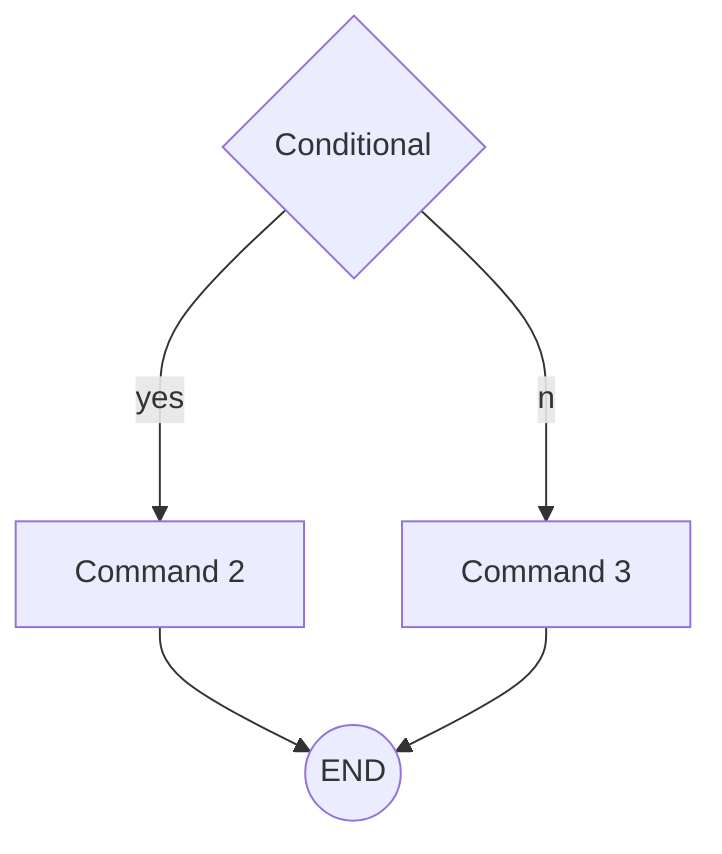
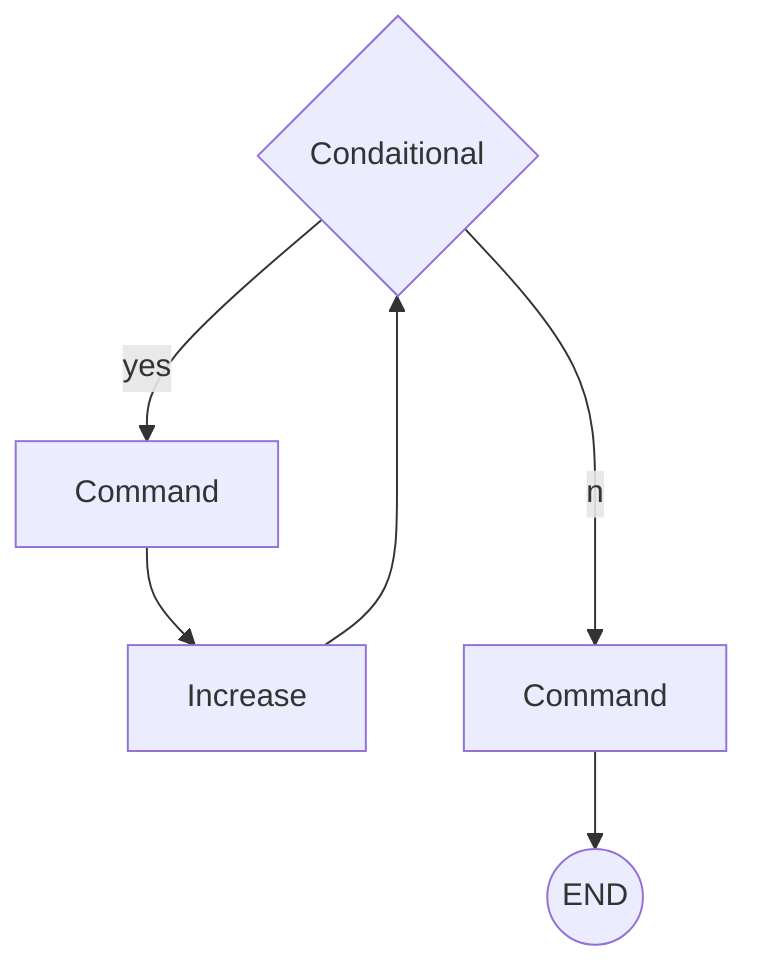
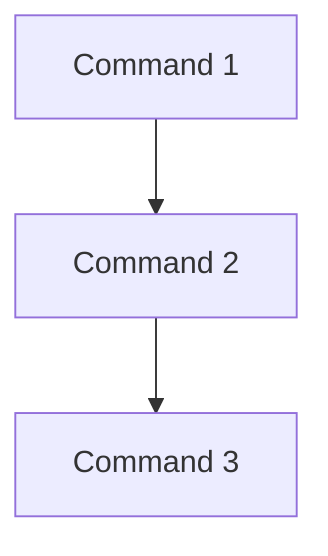

# Intro_To_Algorithms
The repository of the introductory algorithm class

# Algorithms
An **algorithm** is a list of rules to follow in order to *solve a problem.*

### Characteristics

1.  **Finiteness:**  An algorithm should have *finite number of steps* and it should *end after a finite time.*
2.  **Input:** An algorithm may *have many inputs or no inputs* at all.
2.  **Output:** It should *result at least one output.*
3.  **Definiteness:**  Each step must be *clear, well-defined and precise.* There should be **no** any ambiguity.
4.  **Effectiveness:** Each step must be *simple* and should take a finite amount of time

## Ways to represent algorithms
### Flowcharts
They are graphic representations of the necessary steps that lead to the algorithmic solution of a problem. To design them, certain symbols or figures are used that represent an action within the procedure.
### Pseudocode
Write the algorithm instructions in natural language, as we express it on a daily basis, this procedure makes it easier to write in programming languages.

## Control structures
1. **Conditional:** Tests a condition, then executes one sequence of statements instead of another, depending on whether the condition is true or false.


 ```java
if (number>0) {
System. out. println(numeber + " is positive");
} else if (number < 0){
System. out. println(number + " is negative");
} else {
System. out. println("is zero");
}
  ```
  
2. **Iteration:** Executes a sequence of statements repeatedly as long as a condition holds true.


```java
for(int i=0; i<10; i++){
System. out. println("This message will appear 10 times");
}
```
3. **Sequence:** executes a sequence of statements in the order in which they occur.
flowcharts


```java
System. out. println("First message");
System. out. println("Second message");
System. out. println("Third message");
```
## Control structures
### if else
An **if** statement is a conditional statement that runs a different set of statements depending on whether an expression is true or false. 
The **else** statement is to specify a block of code to be executed, if the condition in the if statement is false.

 ```java
if(condition){
  //code to be executed if the condition is true
}else{
  //code to be executed if the condition is false
}
```
### For
Loops can execute a block of code a number of times. The **for** loop in Java is useful for iterating over arrays and for sequential processing.
 ```java
for (initialization; termination;     increment) {
    statement(s)
}
 ```

### While
A **while** loop is a control flow statement that allows code to be executed repeatedly based on a given Boolean condition.
 ```java
while (condition){
   statements;
}  
```
### Do while
A  **do-while**  loop is similar to while loop statement but the do-while loop, the loop body will be executed first, then condition is evaluated. If the condition is true, the loop body will be executed. Otherwise the loop will be terminated. The advantage of a do...while loop is that it executes the block of code  **at least once**  , and then repeatedly executes the block depending on the condition.
 ```java
do {
  statements;
} while (condition);
 ```

## Variables and constants
1. **Constant:** a value that cannot be altered by the program during normal execution.
2. **Variable** a value that can be changed during the program’s execution.

## Types of computational data
1. **Numeric:** data type expressed in numbers, rather than natural language description
2. **Logic:** can have only two possible values: *true (1) or false (0).* This data type is useful in conditional statements
3. **String and characters:** a sequence of characters, either as a literal constant or as some kind of variable.
4. **Arrangements:** a finite, homogeneous and ordered group or collection of elements.


# Computacional Operations
The **operators** indicate what action or operation to perform.

## Arithmetic Operators
An operator performs an action on one or more operands. The common arithmetic operators are:

Accion  | Common symbol
------- | ------------------
Addition | +
Subtraction | -
Multiplication | * 
Division | / 
Modulus (associated with intergers) | %

## Logical Operators
A symbol or word used to connect two or more expressions such that the value of the compound expression produced depends only on that of the original expressions and on the meaning of the operator.

Language | AND | OR | NOT
------------|-------|-----|---
C++ | && |  ll  | !
C# | && |  ll  | !
Java | && |  ll  | ! 
Javascript | && |  ll  | !
Python | and |  or  | not

## Relational Operators
A programming language construct or operator that tests or defines some kind of relation between two entities.

Operator  | Meaning
------- | ------------------
< | less than
> | greater than
<= | less than or equal to 
>= | greater than or equal to 
== | equality (equal to) 
!= OR <> | inequality (not equal to)

# Computacional Operands
The **operands** indicate what items to apply the action to.

# Computacional Expressions
An  **expression**  is a combination of one or more operands, zero or more operators, and zero or more pairs of parentheses.


-   An  **arithmetic expression**  evaluates to a single arithmetic value.
 The following code describes the use of different arithmetic expressions
 int x, y, z; // Three integer variables declared at the same time.  
```java
x = 10;  
y = 12;  
z = y / x; 
// z is assigned the value of y divided by x.  
// Here z will have value 1.  
  
z = x + y; 
// z is assigned the value of x+y 
// Here z will have value 22.  
  
z = y % x 
// z is assigned the value of remainder when y 
// is divided by x. Here z will have value 2.
```
-   A  **logical**  or  **relational expression**  evaluates to a single logical value.  Expressions which are either true or false. The different boolean operators are < (less than), > (greater than),  == (equal to), >= (greater or equal to), <= (less or equal), != (not equal to).
Example:  
 ``` java
int x = 10;  
int y = 4;  
int z = 5;  
  
(x < 10) // This expression checks if x is less than 10.  
  
(y > 1) // This expression checks if y is greater than 1.  
  
((x - y) == (z + 1)); 
// This expression checks if (x - y) equals (z + 1).
```
- Can also be a combination of other boolean expressions. Two or more boolean expressions can be connected using &&  (logical AND) and || (logical OR) operators.
 ``` java
int x = 10; int y = 4; int z = 5;  
  
(x <= 10) && (y > 1) 
// This expression checks if x is less than 10 
// AND y is greater than 1.  
// This expression is TRUE.  
  
(x*y == 41) || (z == 5) 
// This expression checks if x*y is equal to 40 
// OR if z is equal to 5.  
// This expression is FALSE
``` 
