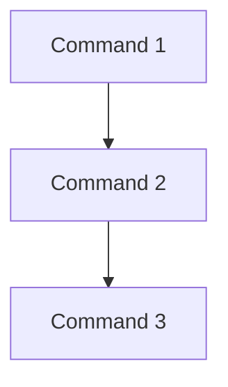

# Intro_To_Algorithms
The repository of the introductory algorithm class

# Algorithms
An **algorithm** is a list of rules to follow in order to *solve a problem.*

### Characteristics

1.  **Finiteness:**  An algorithm should have *finite number of steps* and it should *end after a finite time.*
2.  **Input:** An algorithm may *have many inputs or no inputs* at all.
2.  **Output:** It should *result at least one output.*
3.  **Definiteness:**  Each step must be *clear, well-defined and precise.* There should be **no** any ambiguity.
4.  **Effectiveness:** Each step must be *simple* and should take a finite amount of time

## Ways to represent algorithms
### Flowcharts
They are graphic representations of the necessary steps that lead to the algorithmic solution of a problem. To design them, certain symbols or figures are used that represent an action within the procedure.
### Pseudocode
Write the algorithm instructions in natural language, as we express it on a daily basis, this procedure makes it easier to write in programming languages.

## Control structures
1. **Conditional:** Tests a condition, then executes one sequence of statements instead of another, depending on whether the condition is true or false.
 ```mermaid 
graph TD
A{Conditional} --yes--> B[Command 2]
A --no-->C[Command 3]
B --> D((END))
C -->D
```

2. **Iteration:** Executes a sequence of statements repeatedly as long as a condition holds true.

 ```mermaid 
graph TD
A{Condaitional} --yes--> B[Command ]
B--> D[Increase]
D-->A
A--no-->C[Command ]
C-->E((END))
```

3. **Sequence:** executes a sequence of statements in the order in which they occur.
flowcharts



## Variables and constants
1. **Constant:** a value that cannot be altered by the program during normal execution.
2. **Variable** a value that can be changed during the program’s execution.

## Types of computational data
1. **Numeric:** data type expressed in numbers, rather than natural language description
2. **Logic:** can have only two possible values: *true (1) or false (0).* This data type is useful in conditional statements
3. **String and characters:** a sequence of characters, either as a literal constant or as some kind of variable.
4. **Arrangements:** a finite, homogeneous and ordered group or collection of elements.
